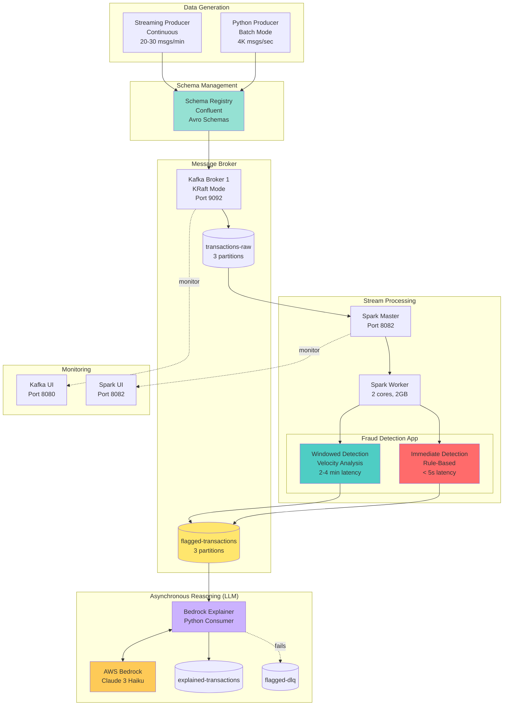
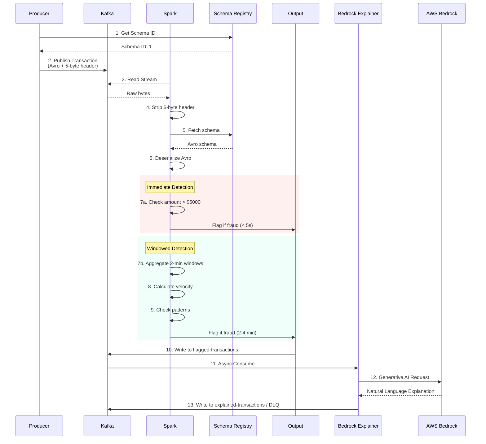

# 🚀 Real-Time Fraud Detection Pipeline

A production-grade real-time fraud detection system built with Apache Kafka, Spark Structured Streaming (Scala), and Confluent Schema Registry. Processes thousands of transactions per second with sub-second to 2-minute latency depending on detection approach.

## 📐 Architecture



### 🔍 Detection Flow Detail



## 🎯 Fraud Detection Approaches

### 1️⃣ Immediate Rule-Based Detection
**Purpose:** Fast response for obvious fraud patterns  
**Latency:** < 5 seconds  
**Use Case:** High-value transaction alerts, simple threshold rules

**Detection Rules:**
```scala
- amount > $5,000           → Fraud Score: 0.9 (HIGH_AMOUNT)
- is_fraud == true          → Fraud Score: 0.8 (LABELED_FRAUD)
- Threshold: score > 0.5    → Flagged
```

### 2️⃣ Windowed Velocity-Based Detection ⭐ Production-Grade
**Purpose:** Detect sophisticated fraud patterns and unusual behavior  
**Latency:** 2-4 minutes (watermark delay)  
**Use Case:** Real production fraud detection systems

**Detection Rules:**
```scala
Window: 2 minutes sliding, 30-second intervals
Watermark: 2 minutes (handles late data)

- velocity > $5,000/min     → Fraud Score: 0.95 (VERY_HIGH_VELOCITY)
- velocity > $2,500/min     → Fraud Score: 0.85 (HIGH_VELOCITY)
- count > 3 in 2 min        → Fraud Score: 0.70 (RAPID_TRANSACTIONS)
- avg_amount > $3,000       → Fraud Score: 0.70 (HIGH_AVERAGE)
- Threshold: score > 0.5    → Flagged
```

**Why Windowing Matters:**
- Detects patterns across multiple transactions
- Velocity analysis catches rapid spending
- Time-based aggregations reveal abnormal behavior

### 3️⃣ Asynchronous LLM Reasoning (AWS Bedrock)
**Purpose:** Provide human-readable explanations for transactions flagged by the Spark pipelines.  
**Latency:** Independent from the real-time stream.  
**Architecture Benefit:** Decoupled Python consumer with DLQ prevents blocking the main Spark pipeline while still delivering GenAI explanations.

## 🏗️ Tech Stack

| Component          | Technology              | Version   | Purpose                          |
|--------------------|-------------------------|-----------|----------------------------------|
| Message Broker     | Apache Kafka            | 7.7.0     | Distributed streaming platform   |
| Stream Processing  | Apache Spark            | 3.5.3     | Large-scale data processing      |
| Processing Language| Scala                   | 2.12.18   | Spark application development    |
| Schema Management  | Confluent Schema Registry | 7.7.0   | Avro schema evolution            |
| Serialization      | Apache Avro             | -         | Efficient binary encoding        |
| Build Tool         | SBT                     | 1.10.2    | Scala build management           |
| Containerization   | Docker Compose          | -         | Local infrastructure             |
| Data Generation    | Python + Faker          | 3.14      | Synthetic transaction data       |

## 🚀 Quick Start

### Prerequisites
- Docker Desktop
- Java 17+
- SBT 1.10.2
- Python 3.9+

### 1. Clone and Setup
```bash
git clone https://github.com/yourusername/kafka-spark-bedrock-fraud-pipeline.git
cd kafka-spark-bedrock-fraud-pipeline
```

### 2. Start Infrastructure
```bash
docker compose -f docker/docker-compose.yml up -d
```

**Verify:**
- Kafka UI: http://localhost:8080
- Spark Master UI: http://localhost:8082

### 3. Create Kafka Topics
```bash
./scripts/setup-kafka-topics.sh
```

### 4. Install Python Dependencies
```bash
cd producer
pip install -r requirements.txt
```

### 5. Register Avro Schema
```bash
python register_schema.py
```

### 6. Build and Start Spark Job
```bash
cd ..
./scripts/build-and-submit.sh
```

Wait for: `=== All streams started. Waiting for data... ===`

### 3. Create Kafka Topics
```bash
./scripts/setup-kafka-topics.sh
```

### 4. Install Python Dependencies
```bash
cd producer
pip install -r requirements.txt
```

### 5. Register Avro Schema
```bash
python register_schema.py
```

### 6. Build and Start Spark Job
```bash
cd ..
./scripts/build-and-submit.sh
```

Wait for: `=== All streams started. Waiting for data... ===`

### 7. Produce Transactions

**Streaming Producer (recommended for windowed detection):**
```bash
cd producer
python streaming_producer.py 5 20
```

**Batch Producer (quick demo):**
```bash
cd producer
python producer.py
```

### 8. Monitor Results
```bash
# Query flagged transactions
docker exec kafka-1 kafka-console-consumer \
  --bootstrap-server localhost:9092 \
  --topic flagged-transactions \
  --from-beginning
```

### 9. Run Bedrock Explainer (optional)
```bash
cd producer
export KAFKA_BOOTSTRAP_SERVERS="localhost:29092"
export AWS_REGION="us-east-1"
python bedrock_explainer.py
```

---

## 🔍 Example Outputs

### Windowed Velocity Detection (Spark)
```json
{
  "window": { "start": "2026-01-27T10:00:00.000Z", "end": "2026-01-27T10:02:00.000Z" },
  "user_id": "user-0042",
  "window_amount": 38750.50,
  "window_count": 5,
  "velocity": 19375.25,
  "fraud_reason": "HIGH_VELOCITY",
  "rule_score": 0.95
}
```

### Bedrock GenAI Explanation (Python)
```json
{
  "transaction_id": "a7f2b8c4-9d3e-4a1b-8c6d-f2e4a8b9c1d3",
  "user_id": "user-0042",
  "fraud_reason": "HIGH_VELOCITY",
  "llm_explanation": "This user executed 5 transactions totaling over $38,000 in under two minutes. This velocity heavily suggests an automated script or a compromised account successfully draining funds.",
  "status": "SUCCESS"
}
```

---

## 🎓 Key Technical Learnings

### 1. Schema Registry Wire Format
**Problem:** Confluent Schema registry prepends a 5-byte header (magic byte + schema ID) to Avro messages, which breaks Spark's native `from_avro()` function.
**Solution:** I implemented a custom Scala UDF to cleanly slice off the first 5 bytes before attempting deserialization, preserving exactly-once compatibility.

### 2. Watermarking for Late Data
In distributed systems, data arrives out of order. Instead of blocking the stream, I applied a 2-minute watermark (`.withWatermark("timestamp", "2 minutes")`) in Spark. This allows the windowed aggregation to tolerate delayed Kafka messages without dropping them or causing OOM (Out Of Memory) errors over time.

### 3. Asynchronous APIs in Streaming
Calling an LLM synchronously per-transaction inside a Spark `map()` operation destroys parallelization. By isolating AWS Bedrock into an independent Python consumer, the Spark cluster remains laser-focused on mathematical velocity scoring at thousands of messages per second.

---

## 🏛️ Project Structure

```
.
├── docker/
│   └── docker-compose.yml          # Infrastructure definition
├── spark-app/
│   ├── src/main/scala/com/omarfg/fraud/
│   │   └── FraudPipelineApp.scala  # Main Spark streaming app
│   └── build.sbt                   # SBT build configuration
├── producer/
│   ├── producer.py                 # Batch producer
│   ├── streaming_producer.py       # Continuous producer
│   ├── bedrock_explainer.py        # Async Bedrock Explainer + DLQ
│   ├── schema.py                   # Avro schema definition
│   ├── register_schema.py          # Schema registration
│   └── requirements.txt            # Python dependencies
└── scripts/
    ├── build-and-submit.sh         # Build JAR + submit to Spark
    └── setup-kafka-topics.sh       # Create Kafka topics
```