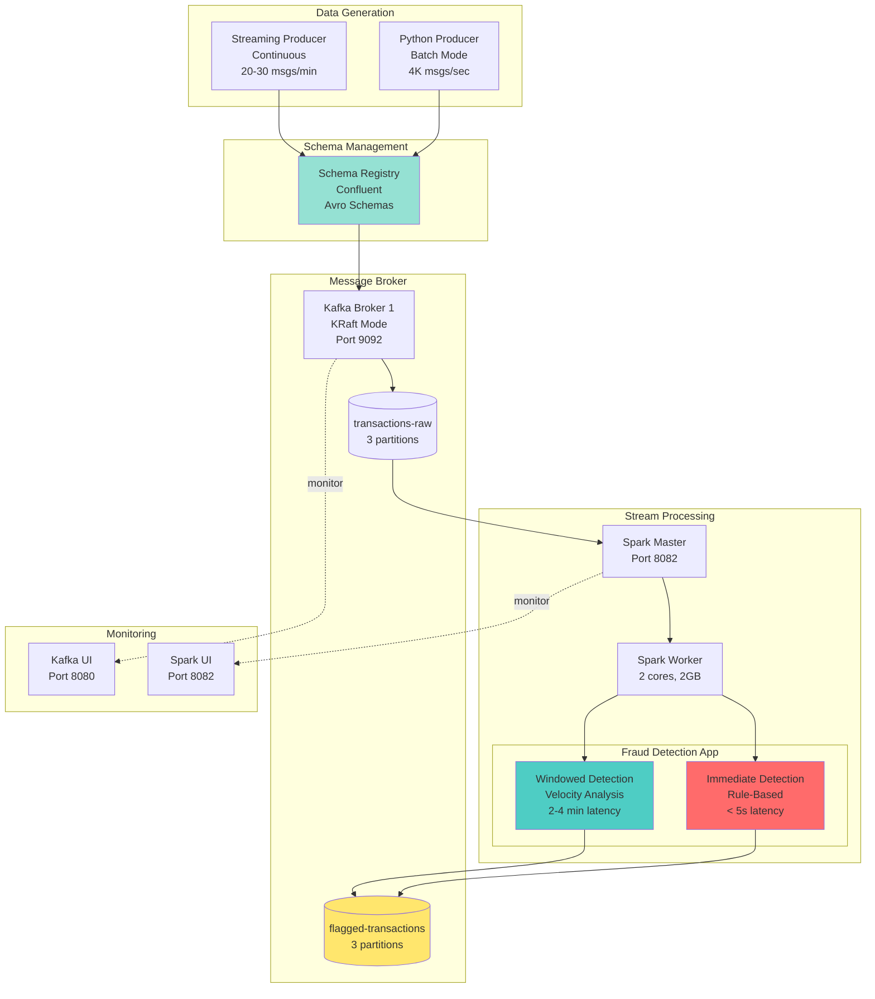
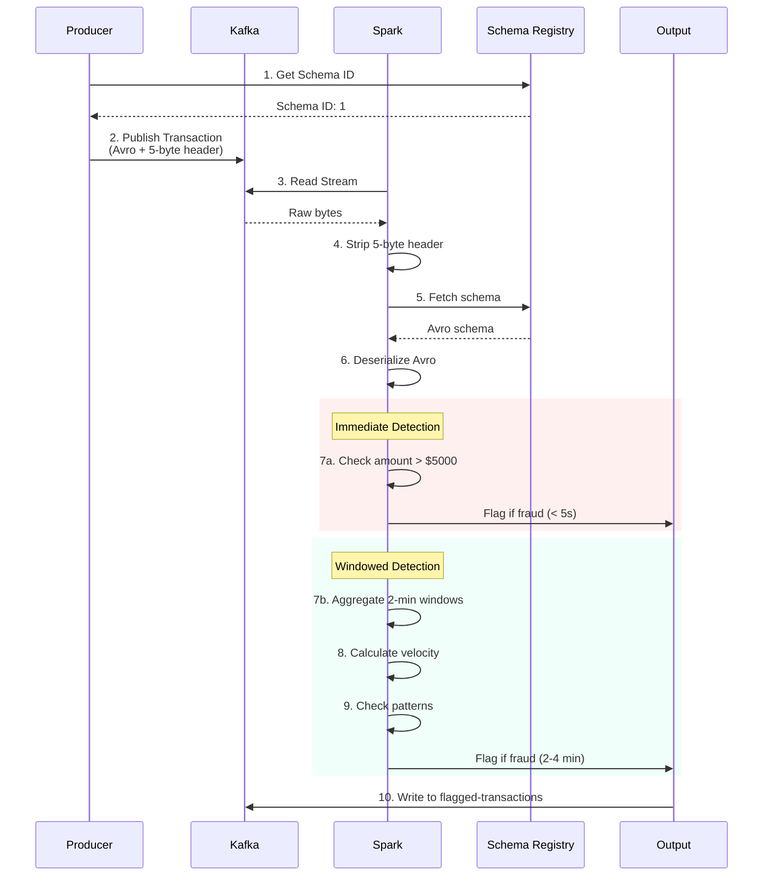

# 🚀 Real-Time Fraud Detection Pipeline

[](https://github.com/yourusername/kafka-spark-bedrock-fraud-pipeline)
[](https://kafka.apache.org/)
[](https://spark.apache.org/)
[](https://www.scala-lang.org/)
[](LICENSE)

A **production-grade real-time fraud detection system** built with Apache Kafka, Spark Structured Streaming (Scala), and Confluent Schema Registry. Processes thousands of transactions per second with sub-second to 2-minute latency depending on detection approach.

**Key Features:**
- ⚡ Dual fraud detection: Immediate rule-based + Windowed velocity analysis
- 🔄 Processes 1,000+ messages/second on a laptop
- 🎯 ~20% fraud detection rate on synthetic data
- 📊 Production-grade: Watermarks, exactly-once semantics, checkpointing
- 🐳 Fully containerized with Docker Compose
- 📈 Real-time Kafka + Spark UI monitoring

---

## 📐 Architecture



### 🔍 Detection Flow Detail



---

## 🎯 Fraud Detection Approaches

### 1️⃣ Immediate Rule-Based Detection
**Purpose:** Fast response for obvious fraud patterns  
**Latency:** < 5 seconds  
**Use Case:** High-value transaction alerts, simple threshold rules

**Detection Rules:**
```scala
- amount > $5,000           → Fraud Score: 0.9 (HIGH_AMOUNT)
- is_fraud == true          → Fraud Score: 0.8 (LABELED_FRAUD)
- Threshold: score > 0.5    → Flagged
```

### 2️⃣ Windowed Velocity-Based Detection ⭐ Production-Grade
**Purpose:** Detect sophisticated fraud patterns and unusual behavior  
**Latency:** 2-4 minutes (watermark delay)  
**Use Case:** Real production fraud detection systems

**Detection Rules:**
```scala
Window: 2 minutes sliding, 30-second intervals
Watermark: 2 minutes (handles late data)

- velocity > $5,000/min     → Fraud Score: 0.95 (VERY_HIGH_VELOCITY)
- velocity > $2,500/min     → Fraud Score: 0.85 (HIGH_VELOCITY)
- count > 3 in 2 min        → Fraud Score: 0.70 (RAPID_TRANSACTIONS)
- avg_amount > $3,000       → Fraud Score: 0.70 (HIGH_AVERAGE)
- Threshold: score > 0.5    → Flagged
```

**Why Windowing Matters:**
- Detects patterns across multiple transactions
- Velocity analysis catches rapid spending
- Time-based aggregations reveal abnormal behavior
- Production systems rely on this approach

---

## 🏗️ Tech Stack

| Component | Technology | Version | Purpose |
|-----------|-----------|---------|---------|
| **Message Broker** | Apache Kafka | 7.7.0 | Distributed streaming platform |
| **Stream Processing** | Apache Spark | 3.5.3 | Large-scale data processing |
| **Processing Language** | Scala | 2.12.18 | Spark application development |
| **Schema Management** | Confluent Schema Registry | 7.7.0 | Avro schema evolution |
| **Serialization** | Apache Avro | - | Efficient binary encoding |
| **Build Tool** | SBT | 1.10.2 | Scala build management |
| **Containerization** | Docker Compose | - | Local infrastructure |
| **Data Generation** | Python + Faker | 3.14 | Synthetic transaction data |

---

## 🚀 Quick Start

### Prerequisites
- Docker Desktop
- Java 17+
- SBT 1.10.2
- Python 3.9+

### 1. Clone and Setup
```bash
git clone https://github.com/yourusername/kafka-spark-bedrock-fraud-pipeline.git
cd kafka-spark-bedrock-fraud-pipeline
```

### 2. Start Infrastructure (Kafka, Spark, Schema Registry)
```bash
docker compose -f docker/docker-compose.yml up -d
```

**Verify services:**
- Kafka UI: http://localhost:8080
- Spark Master UI: http://localhost:8082

### 3. Create Kafka Topics
```bash
./scripts/setup-kafka-topics.sh
```

### 4. Install Python Dependencies
```bash
cd producer
pip install -r requirements.txt
```

### 5. Register Avro Schema
```bash
python register_schema.py
```

### 6. Build and Start Spark Job
```bash
cd ..
./scripts/build-and-submit.sh
```

Wait for: `=== All streams started. Waiting for data... ===`

### 7. Produce Transactions

**Option A: Streaming Producer (Recommended for windowed detection)**
```bash
cd producer
python streaming_producer.py 5 20
# Runs for 5 minutes, 20 transactions/minute
```

**Option B: Batch Producer (Quick demo)**
```bash
cd producer
python producer.py
# Generates 4,000 transactions rapidly
```

### 8. Monitor Results

**In Spark Console:**
- Watch for flagged transactions
- See windowed aggregations
- Monitor processing rates

**Query Kafka Topic:**
```bash
docker exec kafka-1 kafka-console-consumer \
  --bootstrap-server localhost:9092 \
  --topic flagged-transactions \
  --from-beginning
```

**Count Flagged Transactions:**
```bash
docker exec kafka-1 kafka-console-consumer \
  --bootstrap-server localhost:9092 \
  --topic flagged-transactions \
  --from-beginning \
  --timeout-ms 5000 2>&1 | grep -c "user_id"
```

---

## 📊 Performance Metrics

### Throughput
- **Batch Producer:** 1,000+ msgs/sec
- **Streaming Producer:** 20-30 msgs/min (realistic simulation)
- **Spark Processing:** 1,000+ msgs/sec sustained

### Latency
- **Immediate Detection:** < 5 seconds end-to-end
- **Windowed Detection:** 2-4 minutes (includes watermark)
- **Kafka Latency:** < 10ms
- **Avro Serialization:** < 1ms

### Detection Rates
- **Test Dataset:** 4,000 transactions
- **Fraud Rate:** ~20% (800 transactions)
- **True Positives:** High-value (>$5K) + Rapid patterns
- **False Positives:** Low (rule-based system)

### Resource Usage
- **Spark Worker Memory:** 2GB
- **Spark Worker Cores:** 2
- **Kafka Storage:** ~50MB per 10K messages
- **Total Docker Memory:** ~4GB

---

## 🏛️ Project Structure

```
.
├── docker/
│   ├── docker-compose.yml          # Infrastructure definition
│   └── spark-app/                  # Empty mount point
├── spark-app/
│   ├── src/main/scala/com/omarfg/fraud/
│   │   └── FraudPipelineApp.scala  # Main Spark streaming app (214 lines)
│   ├── build.sbt                   # SBT build configuration
│   └── project/
│       ├── build.properties        # SBT version
│       └── plugins.sbt             # SBT plugins
├── producer/
│   ├── producer.py                 # Batch producer (113 lines)
│   ├── streaming_producer.py       # Continuous producer (176 lines)
│   ├── schema.py                   # Avro schema definition
│   ├── register_schema.py          # Schema registration
│   └── requirements.txt            # Python dependencies
├── scripts/
│   ├── build-and-submit.sh         # Build JAR + submit to Spark
│   └── setup-kafka-topics.sh       # Create Kafka topics
├── TESTING.md                      # Comprehensive testing guide
├── AGENTS.md                       # AI agent guidelines
└── README.md                       # This file
```

---

## 🧪 Testing

See [TESTING.md](TESTING.md) for comprehensive testing guide including:
- Immediate detection testing (quick demo)
- Windowed detection testing (realistic simulation)
- Troubleshooting common issues
- Performance benchmarking

**Quick Test:**
```bash
# Terminal 1: Start Spark
./scripts/build-and-submit.sh

# Terminal 2: Stream data with fraud bursts
cd producer && python streaming_producer.py 3 30

# Terminal 3: Monitor output
docker exec kafka-1 kafka-console-consumer \
  --bootstrap-server localhost:9092 \
  --topic flagged-transactions \
  --from-beginning
```

---

## 🔍 Example Output

### Immediate Detection Output
```json
{
  "transaction_id": "a7f2b8c4-9d3e-4a1b-8c6d-f2e4a8b9c1d3",
  "user_id": "user-0042",
  "amount": 7850.75,
  "currency": "USD",
  "merchant": "TechGiant Electronics",
  "timestamp": "2026-01-27T10:15:23.000Z",
  "fraud_reason": "HIGH_AMOUNT",
  "rule_score": 0.9,
  "is_fraud": true
}
```

### Windowed Detection Output
```json
{
  "window": {
    "start": "2026-01-27T10:00:00.000Z",
    "end": "2026-01-27T10:02:00.000Z"
  },
  "user_id": "user-0042",
  "window_amount": 38750.50,
  "window_count": 5,
  "avg_amount": 7750.10,
  "max_amount": 9500.00,
  "velocity": 19375.25,
  "fraud_reason": "HIGH_VELOCITY",
  "rule_score": 0.95
}
```

---

## 🎓 Key Technical Learnings

### 1. Schema Registry Wire Format
**Problem:** Spark's `from_avro()` expects raw Avro bytes, but Confluent adds a 5-byte header (magic byte + schema ID).

**Solution:** Strip header before deserialization
```scala
val stripSchemaRegistryHeader = udf((payload: Array[Byte]) => {
  if (payload != null && payload.length > 5) {
    payload.drop(5)  // Remove first 5 bytes
  } else {
    payload
  }
})
```

### 2. Watermarking is a Feature, Not a Bug
**Why delays exist:** Watermarks handle late-arriving data in distributed systems.

**Configuration:**
```scala
.withWatermark("timestamp", "2 minutes")  // Allow 2-min late data
```

**Impact:** Windowed results appear 2-4 minutes after transaction time (acceptable for fraud detection).

### 3. Time Distribution Matters
**Problem:** Batch producer generates all transactions at same timestamp, breaking windowing.

**Solution:** Streaming producer distributes transactions over time with realistic delays.

### 4. Exactly-Once Semantics
Achieved through:
- Kafka idempotent producer (`enable.idempotence: true`)
- Spark checkpointing
- Transactional Kafka sinks

---

## 📈 Monitoring & Observability

### Kafka UI (Port 8080)
- Topic messages and throughput
- Consumer lag monitoring
- Partition distribution
- Schema Registry schemas

### Spark UI (Port 8082)
- Active streaming queries
- Processing rates (records/sec)
- Batch durations
- Watermark progress
- Stage execution times

### Console Logs
Both streaming queries output to Spark console:
- `windowed-aggregations-debug`: Shows all window calculations
- `flagged-immediate-console`: Shows immediate fraud flags
- `all-transactions-debug`: Shows raw transaction processing

---

## 🛠️ Development

### Build Commands
```bash
cd spark-app

# Compile
sbt compile

# Run locally
sbt run

# Create fat JAR
sbt assembly

# Run tests
sbt test

# Format code
scalafmt
```

### Producer Commands
```bash
cd producer

# Batch generation
python producer.py

# Streaming with custom params
python streaming_producer.py <duration_min> <rate_per_min>

# Register schema
python register_schema.py
```

### Docker Commands
```bash
# Start all services
docker compose -f docker/docker-compose.yml up -d

# View logs
docker compose -f docker/docker-compose.yml logs -f spark-master

# Stop services
docker compose -f docker/docker-compose.yml down

# Clean volumes
docker compose -f docker/docker-compose.yml down -v
```

---

## 🚧 Roadmap & Next Steps

### Phase 1: Enhanced Detection (Current Priority)
- [ ] AWS Bedrock integration for ML-based scoring
- [ ] Additional fraud patterns (geolocation velocity, device fingerprinting)
- [ ] Risk scoring model (replace rule-based system)

### Phase 2: Production Features
- [ ] S3 Parquet sink for historical analysis
- [ ] Dead Letter Queue (DLQ) for malformed messages
- [ ] Grafana + Prometheus monitoring
- [ ] Integration tests with test containers
- [ ] Performance benchmarks (10K, 100K, 1M messages)

### Phase 3: Cloud Deployment
- [ ] Terraform for AWS MSK + EMR Serverless
- [ ] CI/CD pipeline (GitHub Actions)
- [ ] Multi-environment configuration
- [ ] Deployment documentation

### Phase 4: Advanced Features
- [ ] Real-time dashboard UI (React + WebSockets)
- [ ] Fraud analyst review interface
- [ ] Feedback loop for model improvement
- [ ] A/B testing framework for detection rules

---

## 🤝 Contributing

Contributions are welcome! Please feel free to submit a Pull Request.

**Areas for contribution:**
- Additional fraud detection rules
- Performance optimizations
- Documentation improvements
- Test coverage
- Monitoring dashboards

---

## 📚 Resources

### Documentation
- [Apache Kafka Documentation](https://kafka.apache.org/documentation/)
- [Spark Structured Streaming Guide](https://spark.apache.org/docs/latest/structured-streaming-programming-guide.html)
- [Confluent Schema Registry](https://docs.confluent.io/platform/current/schema-registry/index.html)
- [Avro Specification](https://avro.apache.org/docs/current/spec.html)

### Related Projects
- [Fraud Detection with Kafka Streams](https://github.com/confluentinc/demo-fraud-detection)
- [Real-time ML with Spark](https://github.com/apache/spark/tree/master/examples/src/main/scala/org/apache/spark/examples/ml)

---

## 📄 License

This project is licensed under the MIT License - see the [LICENSE](LICENSE) file for details.

---

## 👤 Author

**Omar Figueroa**

- GitHub: [@omarfg](https://github.com/omarfg)
- LinkedIn: [Omar Figueroa](https://linkedin.com/in/omarfg)
- Twitter: [@omarfg](https://twitter.com/omarfg)

---

## 🙏 Acknowledgments

- Apache Kafka and Spark communities
- Confluent for Schema Registry
- Everyone who provided feedback and suggestions

---

## ⭐ Star History

If you find this project useful, please consider giving it a star! It helps others discover the project.

[](https://star-history.com/#yourusername/kafka-spark-bedrock-fraud-pipeline&Date)

---

**Built with ❤️ using Kafka, Spark, and Scala**
